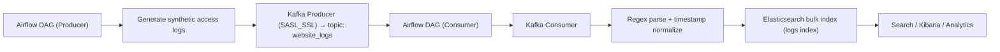

## Realtime Logs → Kafka → Elasticsearch (Airflow DAGs)
<p>
This project contains two Apache Airflow DAGs and a secrets helper:
  
* Producer DAG (`logs_processing_pipeline.py`): generates synthetic web-server access logs and publishes them to a Kafka topic.
* Consumer/Indexer DAG (`logs_processing_pipeline.py`): consumes messages from Kafka, parses each log line, and bulk-indexes documents into Elasticsearch.
* Secrets helper (`utils.py`): fetches credentials/config from AWS Secrets Manager.
  
</p>

### ✨ Highlights
* Realistic log lines via Faker + `random`
* Kafka SASL/SSL authentication (username/password via Secrets Manager)
* Bulk indexing into Elasticsearch for throughput
* Airflow-native scheduling, retries, and logging
* uv for fast, reproducible Python environments

### 🧱 Architecture


### 📦 Repository Layout
```graphql
dags/
  ├─ log_producer.py                 # DAG: generate logs and publish to Kafka
  ├─ logs_processing_pipeline.py     # DAG: consume from Kafka and index to ES
  └─ utils.py                        # Secrets helper for AWS Secrets Manager
```

### 🚀 Quickstart (with uv)
> Prereqs: Python 3.10+ and uv installed
> * Install uv: see https://docs.astral.sh/uv/getting-started/
 (e.g., curl -LsSf https://astral.sh/uv/install.sh | sh)

#### 1) Create project and dependencies
```toml
# pyproject.toml
[project]
name = "realtime-logs-pipeline"
version = "0.1.0"
requires-python = ">=3.10"
dependencies = [
  "apache-airflow==2.9.3",
  "confluent-kafka>=2.3.0",
  "faker>=25.0.0",
  "boto3>=1.34.0",
  "elasticsearch>=8.13.0",
]

[tool.uv]
# Optional: lock all top-level deps for reproducibility
```
<p>Then install the environment (creates a managed venv and resolves deps):</p>

```bash
uv sync
```

> **Airflow note**: Airflow usually recommends “constraints” pins. The above pins work well for most dev setups; if you need strict parity with production, mirror your prod constraint set in the dependency versions.


> **Kafka system deps**: Most platforms use prebuilt wheels, but if you see build errors, install **librdkafka** (e.g., `brew install librdkafka` on macOS).

#### 2) Airflow init & user
```bash
# Initialize metadata DB
uv run airflow db init

# Create an admin user for the UI
uv run airflow users create \
  --username admin --password admin \
  --firstname Admin --lastname User \
  --role Admin --email admin@example.com
```

#### 3) Put DAGs in place & start services
```bash
# Ensure the files live under your $AIRFLOW_HOME/dags/
# (or point AIRFLOW__CORE__DAGS_FOLDER to this repo's dags/ directory)
export AIRFLOW_HOME="${AIRFLOW_HOME:-$PWD/.airflow}"

# Start webserver and scheduler (separate terminals)
uv run airflow webserver --port 8080
uv run airflow scheduler
```

Open [Airflow UI](http://localhost:8080) → turn on:
* log_generation_pipeline (producer)
* log_consumption_pipeline (consumer/indexer)

#### 4) Configure AWS Secrets Manager
Create a JSON secret called MWAA_Side_Project_Secret (or change the name in code):
```json
{
  "KAFKA_BOOTSTRAP_SERVER": "your.kafka.broker:9092",
  "KAFKA_SASL_USERNAME": "your_sasl_username",
  "KAFKA_SASL_PASSWORD": "your_sasl_password",
  "ELASTICSEARCH_URL": "https://your-es-endpoint:9200",
  "ELASTICSEARCH_API_KEY": "your_es_api_key"
}
```
Grant the runtime IAM permission secretsmanager:GetSecretValue on that secret.

---

### ⚙️ Runtime defaults (from code)
| Setting                | Where                         | Default                    |
| ---------------------- | ----------------------------- | -------------------------- |
| Kafka topic (producer) | `log_producer.py`             | `website_logs`             |
| Messages per run       | `log_producer.py`             | `15000`                    |
| Producer schedule      | `log_producer.py`             | `*/2 * * * *`              |
| Consumer schedule      | `logs_processing_pipeline.py` | `*/2 * * * *`              |
| ES index name          | `logs_processing_pipeline.py` | *see “Bugs & fixes”*       |
| Secret name            | both DAGs                     | `MWAA_Side_Project_Secret` |

